# Machine Learning Bird's Eye View

## History of Statistician's Perspective
* Evolved from understanding data. 
* Field of data analysis -> field of mathematics where we try to understand the mechanisms that create data. 
* Probability based models were used to model the world around us.
### Kind of data distributions
* Binomain
* Poisson
* Zipf

These mathematical functions were very helpful to describe the all the aspects of life. But it seemed the very mere oversimplification of the real-life data. 

## History of Computer Scientist's Perspective
* CS felt the need of machines that could observe the data and recognizing the pattern. 
* Instead of following the hard-coded rules, the new techniques are now based on distributions.
* So, now we create models that can provide accurate and very close predictions to the real world data. 
* Drawback: They can't explain why they are making such predictions.

## Types of Machine Learning -

### 1. Supervised Learning
* Studying labeled data, these techniques can extend patterns to unlabeled data. 
* Highest business application in the industry. 
* DL can be used within supervised ML to create techniques that are better at image recognition or identifying when a movie was created based on the video footage.
##### Classification
* Predicts the category to which an item belongs.
* Can be Binary as well as multi-class. 
##### Regression
* Provides numeric outcomes.

### 2. Unsupervised Learning
* Creates model for data that have no pre-existing labels to train on.
* Second most used in business applications. 
* By learning patterns even when data do not have labels, these techniques can group items together that are likely to be similar.
* Applications:
    1. Reducing dataset to a fewer number of useful features.
    2. Grouping similar items
    3. Building Music recommendation systems. 

### 3. Reinforcement Learning
* RL is used to train algorithms that learn based on taking certain actions & receiving rewards for those actions. 
* Applications:
    1. Self-driving cars. 
    2. Game-playing agents. 

## Deep Learning
* Has beaten all other ML algorithms in its ability to predict. 
* Can be used for Supervised, Unsupervised and, RL.
* Till now we have focused on precise prediction, and not on 'how' or 'why' of the predictions. 
 ### Barriers:
* Huge data. 
* Huge computational power. 
* No reasoning of decisions being made.

## ML Libraries
* Tensorflow & Scikit-learn
    1. open-source
    2. advance techniques in un/supervised ML.

## Ethics in ML
* Since our data in real-world holds errors and biases, the models built on them contain the same defects as well. 
* Human biases should always be considered while building the models. 
* Real-world validation of the model is more important than statistical validation. 

## Fitting a line through data. 
### Absolute trick
##### POINT IS BELOW LINE -> INTERCEPT DECREASES.
##### IF POINT HAS -ve X-VALUE -> SLOPE INCREASES.
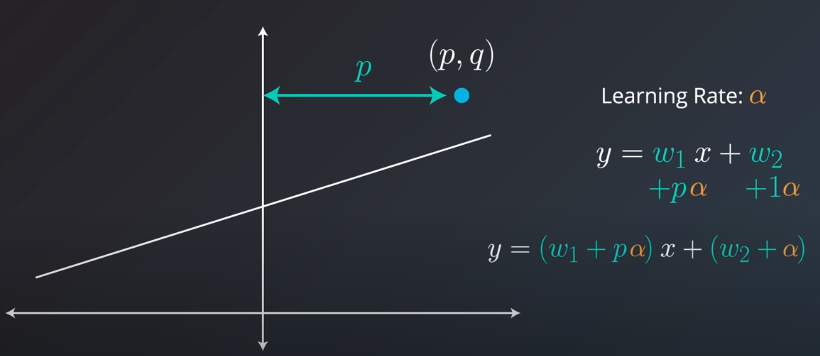
* Equation of line: *y = w1x + w2*
* slope: *w1*
* y-intercepts: *w2*
* Absolute Trick:  Never take large steps. So we use concept of learning rate. (LR)
* *y = (w1 + pα)x + (w2* + α) ; α is LR
* α helps us to tread carefully towards the data points.  

* By increasing *w2* we move the line upwards & vice versa. 
* When the point is below the line: 

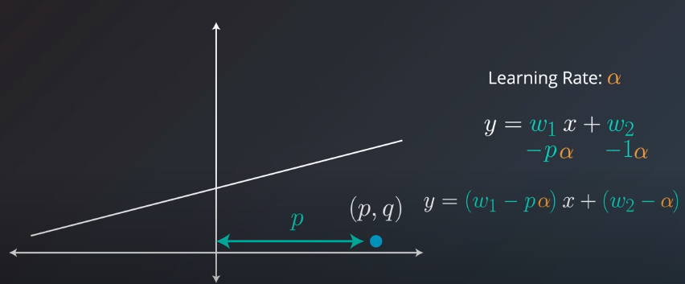 
* When the point of the left side, The line tilts towards the point when -ve *p* is added. 
[Before]:
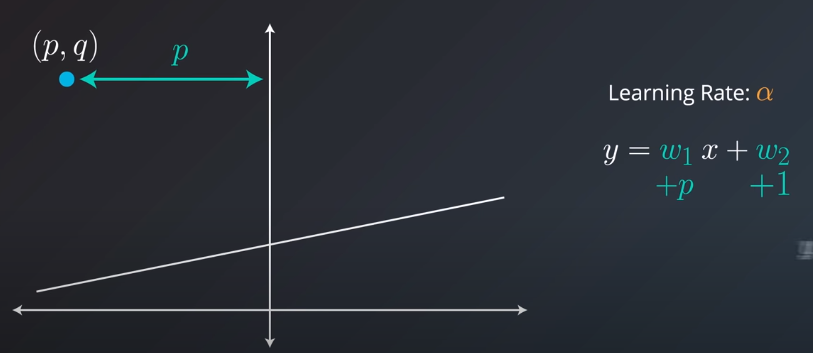
[After adding -ve *p*]:
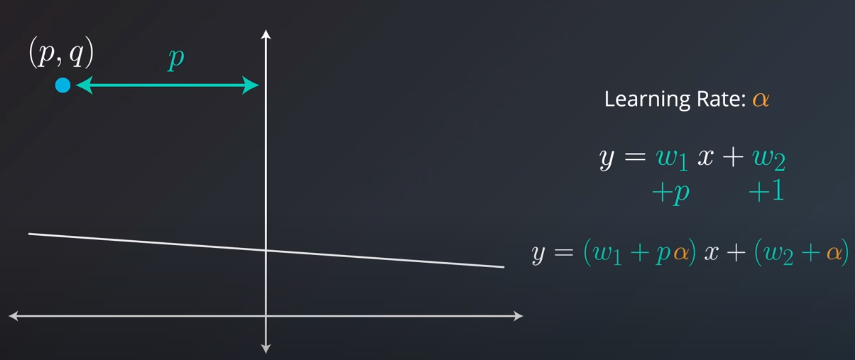
 
* When the point is closer to y-axis --> we add small values to the slope; & vice versa.
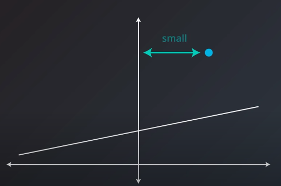

* **Example:**
    **y = -0.6x + 4; point is (-5,3); α is 0.1.**

        y = w1x + w2

        w1 = -0.6 
        
        w2 = 4
        
        p = -5
        
        q = 3
    
        The equation when point is below line equation of line becomes: y = (w1 - pα)x + (w2 - α)

        y = (-0.6 - (-5)*(0.1))x + (4 - 0.1)
    
        y = -0.1x + 3.9

### Square trick
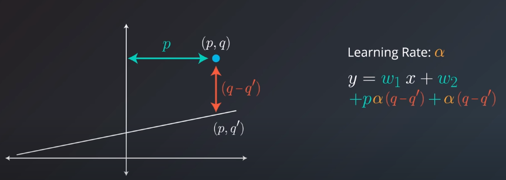
* Here we consider the vertical distance of the point from line; and use this relative distance as add-on to the new equation of line. 

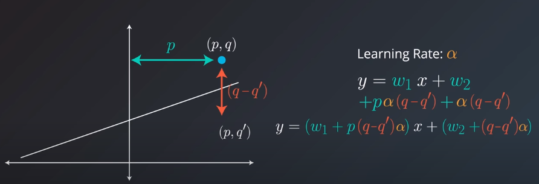
* When the point is below the line, (q=q') is a -ve value, hence the slope reduces.

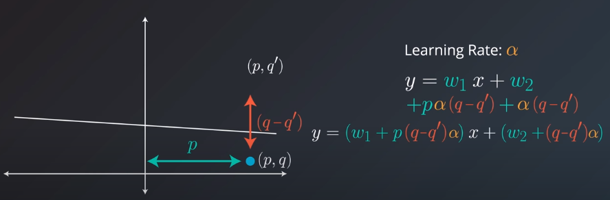

**Example**
**y = -0.6x + 4; point is (-5,3); α is 0.01**

    y = w1x + w2

    w1 = -0.6 
    
    w2 = 4
    
    p = -5
    
    q = 3

    q' = ? (When x = p, we get the value of q' that lies on the line)
        y = (-0.6)(-5) + 4
        y = 7
        so the point becomes (-5, 7) where q' = 7.

    The equation when point is below line equation of line becomes: y = (w1 + p(q-q')α)x + (w2 + (q-q')α)
    
    y = (-0.6 + (-5)(3-7)0.01)x + (4 + (3 -7)0.01)
    y = (-0.6 + 0.2)x + (4 + (-0.04))
    y = -0.4x + 3.96 

## Gradient Descent
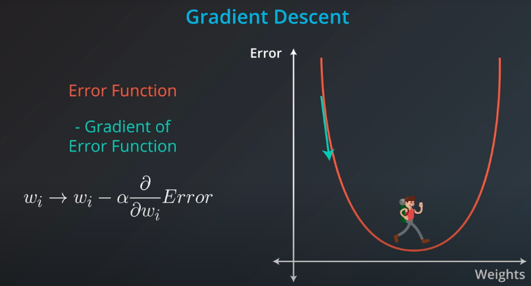

* A method to minimize the error. 
* We take the gradient/derivative of the error functions wrt weights. The gradient points to the direction where the function increases the most. So, we take steps in the the direction -ve to this gradient.

## Error Functions
### MEA
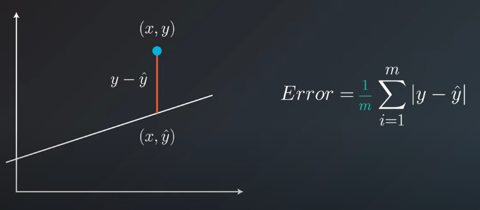
* We don't consider the actual distance of point from the line (ie. perpendicular); instead the vertical distance between the point and its prediction (ie represented via line).
* Since there are *m* points, we divide the absolute sum by *m*.
**Example: MEA error for line: y = 1.2x + 2 & points are (2, -2), (5, 6), (-4, -4), (-7, 1), (8, 14)**
    we calculate the vertical distance of each point from the line. 
    (2,-2) : 4.4 -(-2)  = 6.4 
    (5,6)  : 8 - 6      = 2.0
    (-4,-4): |-2.8-(-4)|= 1.2
    (-7,1) : |-6.4-1|   = 7.4
    (8,14) : |11.6-14|  = 2.4
    So, MEA =  = 20.0/5 = 3.88

### MSE

* Since the area already positve, we dont need the absolute values. 
* we added 1/2 to deal with the derivatives of error.

## Derivative of error function 
* In case of MSE:
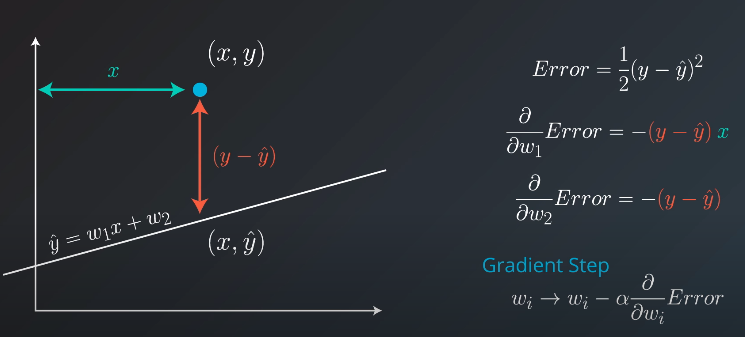
* In case of MAE:
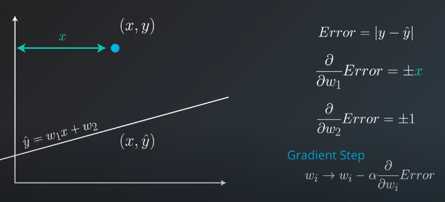
* We know the error is considered wrt slope w1 and wrt y-intercept w2.
* **the derivative of the Error with respect to w2 and verify that it is precisely -(y− y').**

## Mean vs Total Squared (or Absolute) Error
* **How do we know if we should use the mean or the total squared (or absolute) error?**
    
    *: The total squared error is the sum of errors at each point, given by the following equation:*
    
    *whereas the mean squared error is the average of these errors, given by the equation, where mm is the number of points:*

    *it doesn't really matter. As we can see, the total squared error is just a multiple of the mean squared error, since*

